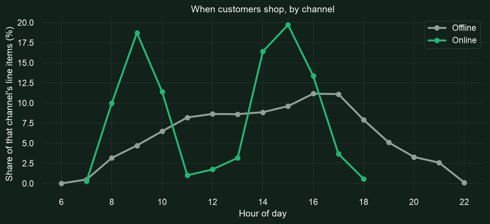
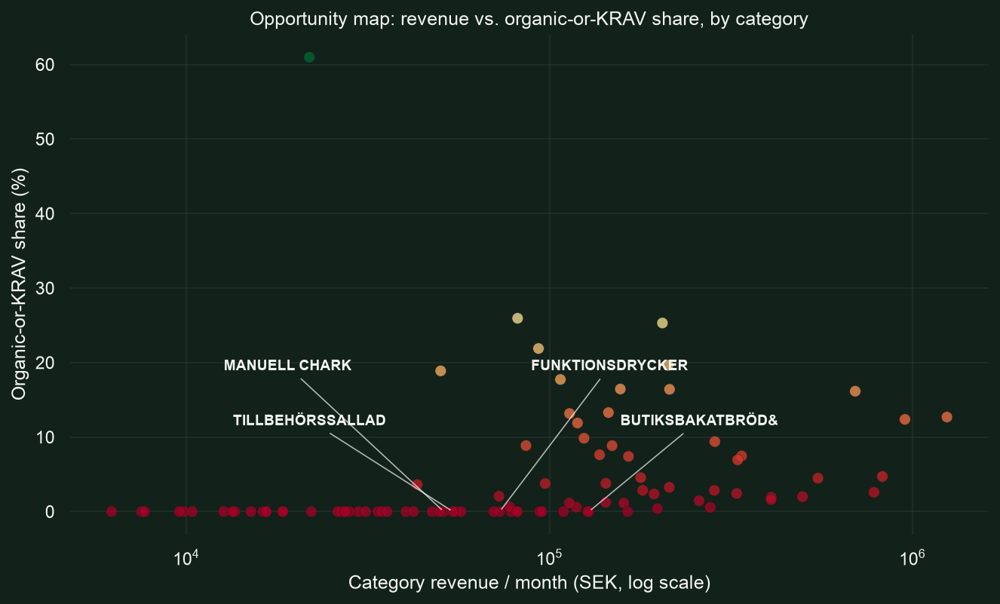

# Coop Case Interview

Data analyst case study for Coop Sverige: EDA notebooks (`Coop_interview_Q1`
through `Q4_5`) and a final analysis/presentation (`Coop_Case_Analysis.ipynb`,
`Coop_Case_Presentation.pptx`).

## Sample findings

